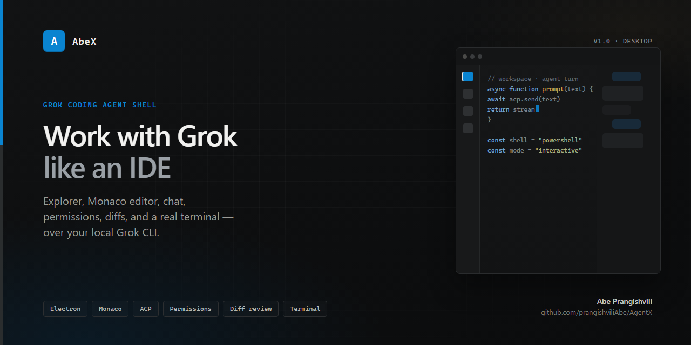

# AbeX

<p align="center">
  
</p>

**AbeX** — VS Code–style desktop shell for the [Grok](https://x.ai) coding agent.

Edit code, chat with Grok, approve tools, review diffs, and run a real terminal — all powered by your local **Grok CLI** account.

| | |
|---|---|
| **Codename** | AbeX |
| **Author** | Abe Prangishvili |
| **Version** | 1.0.0 |
| **License** | MIT |
| **Repo** | [github.com/prangishviliAbe/AgentX](https://github.com/prangishviliAbe/AgentX) |

---

## Features

- **Explorer + Monaco editor** — open a folder, edit files, save with Ctrl/Cmd+S  
- **Grok chat** — ACP stream over `grok agent stdio` (same login as the CLI)  
- **Screenshots / images** — paste (Ctrl+V) or **Attach** images for visual analysis  
- **Tool permissions** — Allow/Deny modal, or auto-approve in Settings  
- **Changes / diffs** — unified diff of agent edits; Apply or Reject  
- **Integrated terminal** — real PowerShell/shell in the workspace cwd  
- **Windows installer** — `npm run dist` → NSIS setup under `release/`

---

## Requirements

- **Windows** (primary), also macOS / Linux  
- [Node.js](https://nodejs.org/) **20+**  
- [Grok CLI](https://x.ai/cli) installed  
- Grok account (`grok login`)

### Install Grok CLI (Windows PowerShell)

```powershell
irm https://x.ai/cli/install.ps1 | iex
grok --version
grok login
```

---

## Quick start

```bash
git clone https://github.com/prangishviliAbe/AgentX.git
cd AgentX
npm install
npm run dev
```

First launch:

1. **Open Folder** — choose a project  
2. **Settings** → confirm **Signed in** (or **Login with Grok**)  
3. Chat in the right panel  
4. Optional: turn **off** *Auto-approve tool calls* for Allow/Deny prompts  
5. **Changes** (activity bar) — review agent file edits  
6. **Terminal** — run shell commands in the workspace  

---

## Scripts

| Command | Description |
|---------|-------------|
| `npm run dev` | Development (Vite + Electron) |
| `npm test` | Unit tests (permission, diff, terminal, wiring) |
| `npm run typecheck` | TypeScript checks |
| `npm run build` | Production build |
| `npm run pack` | Unpackaged app → `release/win-unpacked/` |
| `npm run dist` | Windows installer → `release/AgentX Setup *.exe` |

---

## Installer (Windows)

```bash
npm run dist
```

Artifacts:

- `release/AgentX Setup 1.0.0.exe` — installer  
- `release/win-unpacked/AgentX.exe` — portable run  

---

## Usage tips

| Action | How |
|--------|-----|
| Open folder | Title bar **Open Folder** or Ctrl/Cmd+O |
| Save file | Ctrl/Cmd+S |
| Focus terminal | Ctrl/Cmd+\` (backtick) |
| Tool prompts | Settings → uncheck **Auto-approve tool calls** |
| Apply agent edits | **Changes** → Apply / Reject (or Apply all) |
| Login | Settings → **Login with Grok** |
| Paste screenshot | Focus chat → **Ctrl+V** (or **Attach**) |
| Auto-continue | Settings → **ავტომატურად გააგრძელე** (default on) |

AgentX reuses credentials from `~/.grok/auth.json` (same as CLI). Set `GROK_BIN` if `grok` is not on `PATH`.

Preferences (auto-approve, auto-continue) are saved in `~/.agentx/settings.json`.

Workspace files (e.g. `package.json`) are served to Grok over ACP `fs/read_text_file` so the agent sees the open project correctly.

---

## Architecture

```
┌──────────────────────────────────┐
│  AgentX (Electron + React UI)    │
│  Explorer · Diff · Term · Chat   │
└──────────────┬───────────────────┘
               │ IPC
┌──────────────▼───────────────────┐
│  Main process                    │
│  FS · Diff · Shell · ACP client  │
└──────────────┬───────────────────┘
               │ JSON-RPC / stdio
┌──────────────▼───────────────────┐
│  grok agent stdio                │
│  ~/.grok/auth.json               │
└──────────────────────────────────┘
```

Stack: **Electron · React · TypeScript · Monaco · Vite · electron-builder**

---

## Project layout

```
AgentX/
  electron/          # main process, ACP, FS, terminal
  src/               # React UI
  tests/             # permission, diff, terminal, structural tests
  package.json
```

---

## Development

```bash
npm install
npm run dev          # hot reload UI + Electron
npm test
npm run typecheck
```

If Electron’s binary is missing after install:

```bash
node node_modules/electron/install.js
# or
npm run postinstall
```

---

## Roadmap

- [ ] Session history & resume  
- [ ] Search in files  
- [ ] Auto-update  
- [ ] Signed installers & custom app icon  
- [ ] Themes  

---

## License

MIT © Abe Prangishvili

Not affiliated with xAI. Grok® is a product of xAI. AgentX is an independent open-source shell around the public Grok CLI / ACP interface.
